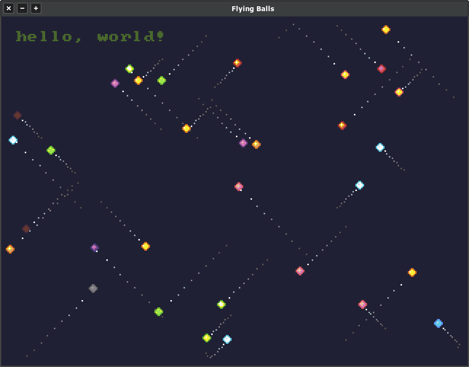

# libretrogd - 'Flying Balls' Demo v2

Extension of the original 'Flying Balls' demo found in this repository under `/examples/balls`. This one is re-done
with some more effects, but with the major difference being utilization of the entity, events, and states support from
libretrogd.

Simply do `cargo run` from this directory to try it out.

