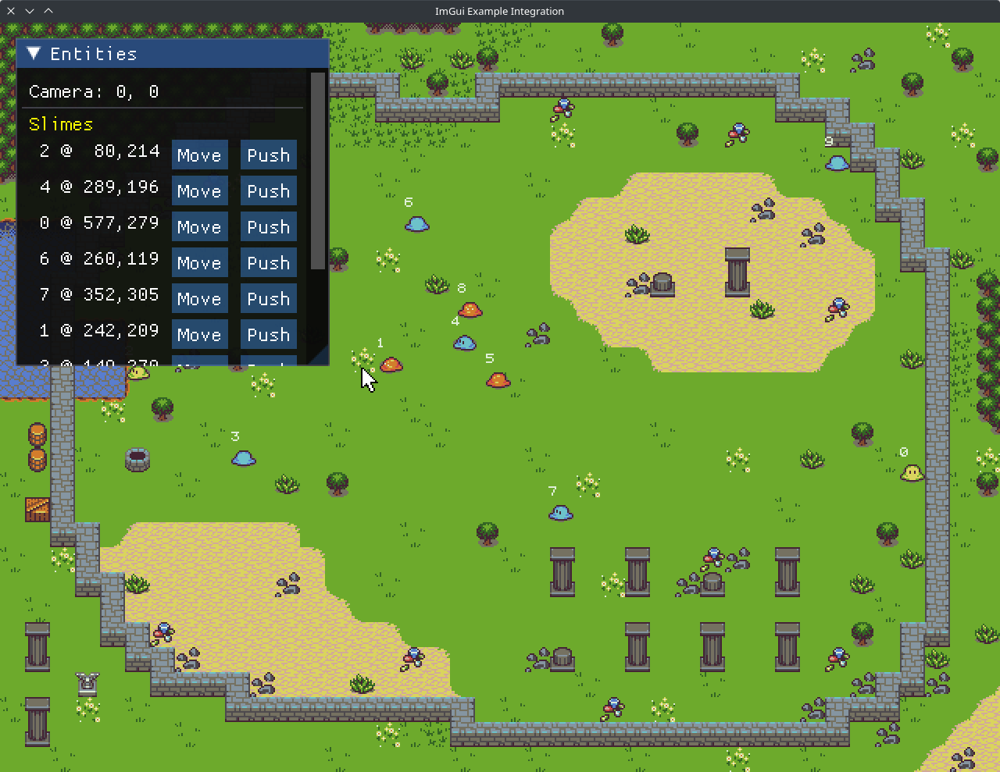

# ggdt - ImGui Integration Demo

Borrows a lot of elements from the "slimed" demo, available in the `/examples` folder that this same demo is located
within, to run a _somewhat_ simpler world and entity system from that demo while showing some bits of entity state
in realtime using an ImGui-based display of this state information.

The primary point of this demo is to show usage of the ggdt ImGui integration in a bigger application that somewhat
resembles a "real" project (that is, using the application state management subsystem, the entity subsystem, etc) to
show how this integration can be done.

The main points of interest in this demo are found in the `main.rs` module.

Simply do `cargo run` from this directory to try it out.

