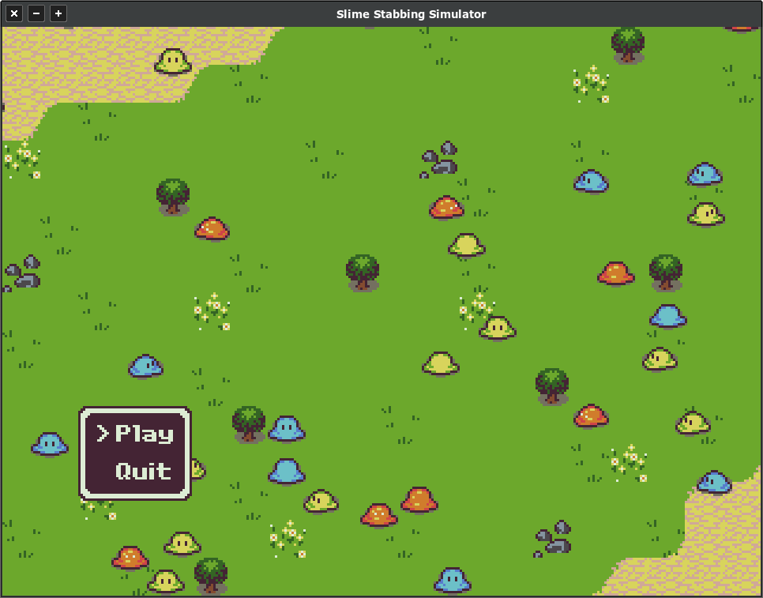

# libretrogd - 'Slime Stabbing Simulator' Demo

A fairly more involved demo which was originally written to test out and learn how good/bad libretrogd's entity,
events and state management support is to use in practice. I learnt a lot from it, and have many ideas to improve 
things now.

Graphics from the awesome [Tiny 16](https://sharm.itch.io/tiny16) by Lanea Zimmerman.

With some Tiny 16 extensions by:

* [speveril](https://opengameart.org/content/tiny-16-basic?page=1#comment-61618)
* [withthelove](https://opengameart.org/content/tiny-16-expanded-character-sprites)

Plus a very small handful of additional graphics by unknown artists because the image files have been sitting on my
hard drive for years and I've forgotten who they were originally from!

**Warning! There is quite a bunch of slow/sloppy code in here!**

Simply do `cargo run` from this directory to try it out.

